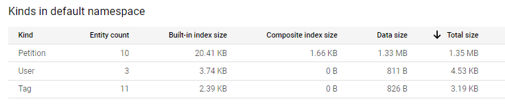
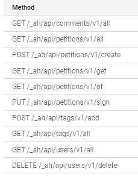
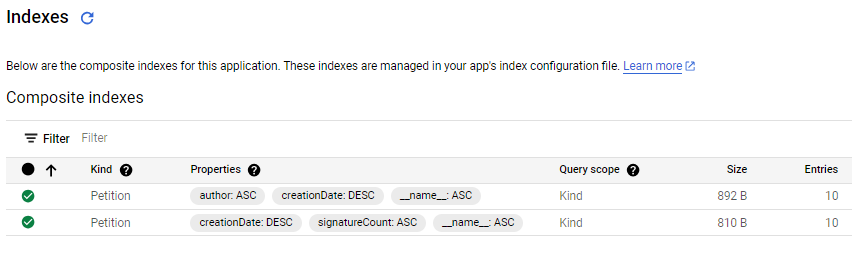

= Tinypet

Projet Cloud ALMA 2023/2024

This guide outlines the necessary steps to run and deploy the application. Please ensure all instructions are followed for the application to function properly.

== Architecture
The application is composed of two main parts:
- The backend, which is a Java application using the JEE Servlet API, and is deployed on Google App Engine.
- The frontend, which is an Angular application, and is deployed on the same App Engine instance as the backend.

== Kinds in Datastore

== API Endpoints

== Indexes in Datastore

== Known Issues
- When refreshing the page, the application will return a 404 not found error. This is due to the application being a single page application, and the server not being configured to handle this. The routes will still work as expected.
- Sometimes, requests to datastore are slow (about 2 to 4 seconds). Thiis is due to the basic instance class of the datastore. This can be fixed by upgrading the instance class, but this will incur additional costs. But caching can also be used to reduce the number of requests to datastore.
- The application is not responsive, and is not optimized for mobile devices.
- The application is not tested on all browsers, and may not work as expected on Safari or old browsers. Https automatic redirection is not supported.
- The login is triggered automatically when refreshing the main page.

== Use prerequisites
* Java 11 installed (Due to Google ending support for Java 8).
* Google Cloud SDK (gcloud) installed, authenticated, and configured with your project.
* Necessary APIs enabled in the Google Cloud Console (Google +, Endpoints, Datastore API...).
* Relevant gcloud services and components installed on your local machine.

== Personnal Configuration Steps

. *Changing the Project ID in pom.xml*:
  - Update the `<projectID>` in `pom.xml` to your Google Cloud Project ID.

. *Installing Required Npm Dependencies*:
  - run `npm i` inside the tinypey-app folder to install all required dependencies for the building.
  - For maven dependencies, no need as the commands bellow do the work.

== Running / Deploying the application

. *Locally*:
  - For Windows, use `run.bat`.
  - For Unix-based systems, use `run.sh`.   (``chmod +x run.sh`` before first execution)

. *To App Engine Cloud Console*:
  - For Windows, use `deploy.bat`.
  - For Unix-based systems, use `deploy.sh`   (``chmod +x deploy.sh`` before first execution)

== Important Notes
- Ensure Java 11 is used, as the project is not compatible with Java 8.
